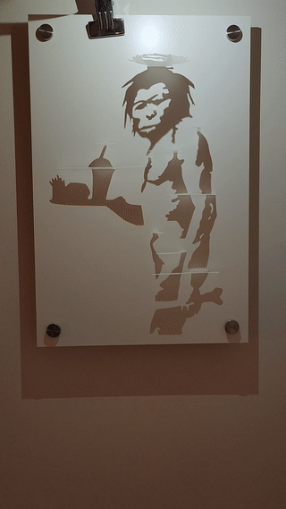
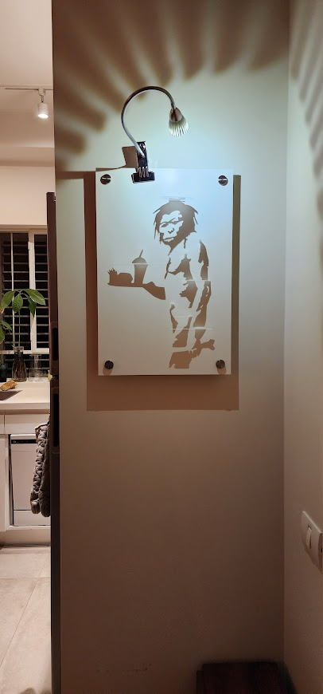

# ShadowArt

A fun art project using laser cutting.
I used my own python implementation of Potrace for tracing the image into svg.
Currently the fastest pure python implementation of Potrace known to me (numpy vectorized).

 

# Crux of the code
The function getLastStraight() in image2vec.py is where the magic happens.

```python
    lessThanMax = angles < np.maximum.accumulate(anglesMax,axis=1)
    greaterThanMin = angles > np.minimum.accumulate(anglesMin,axis=1)
    
    firstLess = np.argmax(lessThanMax,axis=1)-1
    firstGreater = np.argmax(greaterThanMin,axis=1)-1
```
